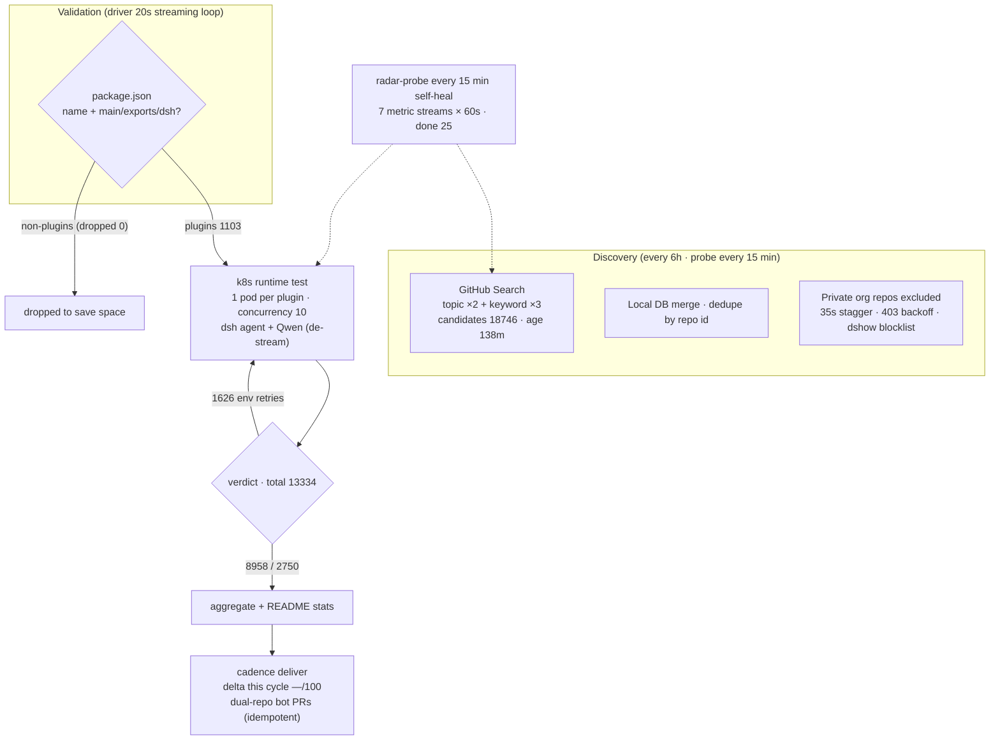

# DSH Plugin Radar

<p align="center">
  <br>
  
</p>

<p align="center">
  <a href="https://trendshift.io/repositories/147500" title="GitHub Trending Daily #22 · 2026-08-14 · all languages"></a>
</p>

**An open-source radar for the DeepSeek Harness plugin ecosystem — continuous discovery, runtime validation, 15-minute snapshots. The plugin catalog you see below is just an artifact it generates.**
Know which plugins work before you install them.

[](#featured) [](#ecosystem-snapshot) [](#how-we-assess-compatibility) [](https://dshfind.com/plugins/AdamPlatin123/dsh-plugin-radar?ref=badge) [](LICENSE)

[](#2-understand-status-unified-4-tier-scale) [](#2-understand-status-unified-4-tier-scale) [](#2-understand-status-unified-4-tier-scale)

[English](README.en-US.md) | [简体中文](README.md)

---

**What is this?** DeepSeek Harness (DSH) is an open-source coding agent where everything is a plugin. This repo is a **radar** that automatically tracks its plugin ecosystem — **1103 plugin repos indexed** (manifest-level classification, v2 engine), **13334 runtime-tested on the k8s track**.

**Architecture principle: the catalog is a build artifact.**

```text
Radar Engine (open-source → engine/)
     ↓
Machine-readable snapshots (data/snapshots/, every 15 min)
     ↓
Catalog renderer (aggregation · classification · bilingual rendering)
     ↓
┌─ PLUGINS-ALL.md full listing
├─ Featured board / bundles
├─ Ecosystem snapshot / compatibility matrix
└─ dshfind & downstream consumers
```

## How it works

> Data as of snapshot `20260906T233001Z` (2026-09-07 07:30:02 UTC+8 · classifier unified-v2-bridge)

<!-- AUTO:pipeline:START -->

<!-- AUTO:pipeline:END -->

**🔌 Open-Source Plan — this page is produced automatically by the DSH Plugin Radar, which is being open-sourced in stages:**

| Phase | Content | Status |
|---|---|---|
| Phase 1 | Pipeline docs: [overview & roadmap](docs/radar/overview.md) · [architecture](docs/radar/architecture.md) · [data contracts](docs/radar/data-contracts.md) | ✅ Open-sourced |
| Phase 2 | Radar engine source (discovery · aggregation · rendering · distribution + ops self-heal) | ✅ Open-sourced → [engine/](engine/) |
| Phase 3 | Test engine source: lightweight edition (no k8s · runs locally) · server edition (k8s cluster) | 🔜 After stabilization |

## Quick Start

| Goal | Link |
|---|---|
| Understand the radar itself | [How it works](#how-it-works) · [open-source engine → engine/](engine/) · [pipeline docs](docs/radar/overview.md) |
| Browse featured plugins | [Featured](#featured) — curated · 11 categories |
| Install a bundle instead of picking one by one | [Bundles](#-bundles) — presets · skill collections · distributions · recipes |
| Find a plugin by use case | [Plugin Catalog](#plugin-catalog) — 13 categories · per-plugin details in [PLUGINS-ALL.md](PLUGINS-ALL.md); [PLUGINS.md](PLUGINS.md) is the PR-registered list |
| Browse all auto-discovered repos | [ Ecosystem Snapshot](#ecosystem-snapshot) — dated compatibility matrix |
| See what changed recently | [ CHANGELOG](CHANGELOG.md) |
| Register or submit a plugin | [ For Plugin Developers](#for-plugin-developers) · add the `dsh-plugin` topic → discovered within 8h · [PR template](.github/PULL_REQUEST_TEMPLATE.md) |
| Learn about the radar & open-source plan | [ Radar overview & roadmap](docs/radar/overview.md) · architecture in [docs/radar/](docs/radar/) |
| Plugin user guide | [ For Plugin Users](#for-plugin-users) |
| How we assess compatibility | [ How We Assess Compatibility](#how-we-assess-compatibility) |
| Join the community | [ dshfind.com](#dsh-learning-community-dshfindcom) · [Discussion group](#community-discussion-group) |

> [!IMPORTANT]
> **Inclusion ≠ compatible, static check ≠ runtime-usable, runtime-usable ≠ security-audited.**
> This repo provides traceable filtering signals, not official DSH endorsement. Always review plugin source, permissions, dependencies, and license before installing.

## 🛒 Ecosystem Catalog (an artifact generated by the radar)

Everything catalog-shaped below — the featured board, bundles, category directory, compatibility matrix — is produced and refreshed by the radar pipeline above (featured/bundle membership is human-curated; stars and statuses are kept fresh by bots).

### Featured

<!-- AUTO:featured:START -->

> 人工策展 56 款插件，按 11 类分组、类内按星标排序；星标每 6 小时自动刷新（成员调整请提 PR 修改 data/awesome-50.json）。数据截至 2026-09-09 19:34（UTC+8）。

### 🚀 智力增强 Booster（7）

-  **[dsh-routing-suite](https://github.com/yjh051108/dsh-routing-suite)** · 7141★ — 注入器 × 思维模式路由套装：免重启运行时注入器 + 任务感知推理模式路由预设（P1-P23 实测）
-  **[ouroboros](https://github.com/Q00/ouroboros)** · 5803★ — Agent OS：agent 自我变强、人只守底线——自进化运行时（5.7k★；rc.8 实测 ✅）
-  **[harmony-next.skills](https://github.com/linhay/harmony-next.skills)** · 346★ — 技能驱动的工作流增强
-  **[superpowers-dsh](https://github.com/LayneChai/superpowers-dsh)** · 89★ — TDD/调试/计划等开发技能集
-  **[forkprobe](https://github.com/Jayden-X-L/forkprobe)** · 72★ — 同一任务跑多个技能对比，自动选优
-  **[dsh-tool-turbo](https://github.com/Electricitysheep/dsh-tool-turbo)** · 7★ — 按轮次自动优化 reasoning_effort（推理力度）
-  **[dsh-reasoning-settings](https://github.com/JuneLearn/dsh-reasoning-settings)** · 6★ — 推理设置控制：让模型按任务切换思考档位

### 🖥 界面与工作台（7）

-  **[dsh-web-ui](https://github.com/zhu1090093659/dsh-web-ui)** · 7221★ — Web UI 增强与皮肤合集：任务看板、Git 图、移动端、皮肤中心
-  **[DSH-better-sidebar](https://github.com/omdsh-dev/DSH-better-sidebar)** · 3456★ — 侧边栏变完整工作台：文件编辑/终端/Git/子代理，支持三方注册扩展页
-  **[dsh-genui](https://github.com/omdsh-dev/dsh-genui)** · 427★ — GenUI 内联组件：图表/表单/测验/3D 场景 + action 事件环
-  **[dsh-visualize](https://github.com/Nagi-ovo/dsh-visualize)** · 258★ — 对话中生成交互式可视化卡片
-  **[dsh-annotation](https://github.com/omdsh-dev/dsh-annotation)** · 112★ — 划选文字→批注→随消息发送，回复逐条对照
-  **[Liang-Saint-Slider](https://github.com/BruzWJ/Liang-Saint-Slider)** · 96★ — 模型与思考力度选择滑条
-  **[dsh-navbar](https://github.com/vlln/dsh-navbar)** · 55★ — 对话节点导航条：右缘节点串快速跳转（官方 bundle 插件）

### ⌨️ 终端与桌面端（5）

-  **[dsh-desktop](https://github.com/anywhere-labs/dsh-desktop)** · 24711★ — 生态最高星桌面客户端（21.5k★，原 deepseek-harness-desktop 再改名）：万物皆插件、桌面本身也是插件（雷达重测中；rc.8 源码路径实测 ✅）
-  **[deepseek-harness-desktop](https://github.com/hairyf/deepseek-harness-desktop)** · 1829★ — Tauri 桌面版：5MB 安装包零环境配置，Win/macOS/Linux
-  **[Bigfish](https://github.com/turtle2209/Bigfish)** · 313★ — 第三方桌面端：内置 Node 运行时，双击即用
-  **[oh-dsh](https://github.com/hust-open-atom-club/oh-dsh)** · 309★ — 社区发行版：桌面/Web/TUI 三形态统一体验
-  **[dsh-tianshu-tui](https://github.com/huiliyi37/dsh-tianshu-tui)** · 268★ — 自研 ANSI 渲染的极简终端 UI

### 👁 视觉与多模态（4）

-  **[modlens](https://github.com/liustack/modlens)** · 3922★ — 生态第一个视觉插件，视觉工作流的基准方案
-  **[agent-vision-toolkit](https://github.com/Anionex/agent-vision-toolkit)** · 1191★ — 通用 agent 视觉工具箱：多图理解/图片问答/前端 UI 还原/GUI 自动化（dsh-vision-toolkit 同作者）
-  **[dsh-vision-router](https://github.com/ysr666/dsh-vision-router)** · 1091★ — 内置免费视觉模型路由，给文本 agent 装眼睛
-  **[dsh-vision-toolkit](https://github.com/Anionex/dsh-vision-toolkit)** · 868★ — 带意图图片问答、长截图 OCR、UI 还原

### 🤖 Agent 能力与编排（7）

-  **[distilly](https://github.com/titanwings/distilly)** · 24464★ — 把专家思维蒸馏为可复用 Skills 的平台（24k★，Agent 域之最，原名 colleague-skill；雷达判可用）
-  **[dsh-agent-teams](https://github.com/NanmiCoder/dsh-agent-teams)** · 1476★ — 多代理团队编排
-  **[helloagents](https://github.com/hellowind777/helloagents)** · 705★ — agent 能力合集
-  **[sandbase-harness](https://github.com/sandbaseai/sandbase-harness)** · 643★ — CMA 兼容开源 agent 运行时，任意模型可驱动
-  **[rea](https://github.com/morluto/rea)** · 400★ — 用 agent 逆向工程任何东西：从应用行为到原生二进制
-  **[open-record-replay](https://github.com/humblebanana/open-record-replay)** · 145★ — macOS 录制回放：把鼠标/键盘/UI 事件存为结构化轨迹供 agent 学习重放
-  **[axern](https://github.com/cofy-x/axern)** · 59★ — AI agent 开源沙箱：不可信代码执行与持久服务

### 💻 编码与生产力（5）

-  **[TokenTracker](https://github.com/xiufengsun/TokenTracker)** · 1553★ — 本地优先的 31 种编码工具 token 用量与成本追踪
-  **[api-relay-audit](https://github.com/toby-bridges/api-relay-audit)** · 825★ — AI API 中继/LLM 代理本地安全审计，产出 Markdown 报告（rc.8 实测 ✅）
-  **[claude-paper](https://github.com/alaliqing/claude-paper)** · 335★ — 跨 agent 论文工具箱：速读摘要/深度研读材料/代码演示 + 本地 Web 阅读器
-  **[mobius](https://github.com/nutshellai-tech/mobius)** · 296★ — 编码增强
-  **[dsh-remote](https://github.com/flymysql/dsh-remote)** · 64★ — 多机远程工作区：SSH 连接管理、远程目录→本地镜像→原生工作区收养、SFTP 双向同步与 rw_* 工具族

### 🧠 记忆与上下文（3）

-  **[EverOS](https://github.com/EverMind-AI/EverOS)** · 12817★ — 全 agent 便携记忆层：本地优先、Markdown-native（12.4k★ 记忆域之最；rc.8 实测 ✅）
-  **[mnemon](https://github.com/mnemon-dev/mnemon)** · 566★ — 跨 agent、本地优先的持久记忆
-  **[dsh-memory-evolve](https://github.com/csyangwen/dsh-memory-evolve)** · 293★ — 五轨记忆 + git 分支托管 + 后台自我进化

### 📡 消息通讯与 IM（4）

-  **[dsh-lark](https://github.com/omdsh-dev/dsh-lark)** · 51★ — 飞书 IM bot 频道（官方渠道插件）
-  **[dsh-message-edit](https://github.com/Moeblack/dsh-message-edit)** · 49★ — 分支式消息编辑、reroll、重试、多版本
-  **[dsh-interconnect](https://github.com/Chinesezjc/dsh-interconnect)** · 35★ — 跨 DSH 实例消息/事件交接
-  **[ChatCCC](https://github.com/wzj998/ChatCCC)** · 22★ — 飞书/微信聊天控制 DSH / Claude Code

### 🗂 文件、数据与浏览（4）

-  **[dsh-browser](https://github.com/Lum1104/dsh-browser)** · 605★ — Chrome 侧栏扩展，让 DSH 直接操作浏览器
-  **[dsh-openpencil](https://github.com/ZSeven-W/dsh-openpencil)** · 168★ — OpenPencil 设计稿预览与编辑
-  **[dsh-web-search-pro](https://github.com/anweat/dsh-web-search-pro)** · 62★ — 增强型持久网页搜索
-  **[dsh-plugin-mineru](https://github.com/HuanLinOTO/dsh-plugin-mineru)** · 46★ — PDF/图片/Office 转结构化 Markdown

### 🛒 市场与管理（4）

-  **[dsh-market](https://github.com/dsh-market/dsh-market)** · 3491★ — 持续收录 1000+ 插件的市场：中文搜索 + 五维评分
-  **[dsh-web-plugin-manager](https://github.com/LX2000WASD/dsh-web-plugin-manager)** · 66★ — Web UI 一键管理插件：启停/装卸/环境管理
-  **[dsh-plugin-check](https://github.com/omdsh-dev/dsh-plugin-check)** · 27★ — 插件健康检查：清单协议/patch 格式/构建陷阱
-  **[deepseek-plugin-store](https://github.com/Ericwong5021/deepseek-plugin-store)** · 25★ — 独立社区插件商店：发现/安装/提交经验证的插件

### 🎮 娱乐生活（6）

-  **[petdex](https://github.com/crafter-station/petdex)** · 4059★ — 生态最高星桌宠图鉴
-  **[dsh-deep-whale](https://github.com/Small-tailqwq/dsh-deep-whale)** · 1977★ — 深海鲸鱼养成
-  **[openpets](https://github.com/alvinunreal/openpets)** · 1177★ — 本地优先桌面伴侣平台：动画宠物 + 插件 SDK（娱乐域第二位）
-  **[dsh-ads](https://github.com/Nagi-ovo/dsh-ads)** · 614★ — 把 DSH 变回 2005 门户网站：怀旧广告/小游戏/弹窗
-  **[whale-girl](https://github.com/vlln/whale-girl)** · 318★ — QQ 宠物形态桌宠：可拖拽/投喂/玩耍
-  **[dsh-kun-like-pet](https://github.com/liyupi/dsh-kun-like-pet)** · 90★ — 小坤桌宠：随 Agent 工作状态切换 9 种动作

> 兼容状态磁贴 = 雷达 k8s 运行级判定（🟩 已兼容 · 🟨 需适配 · ⬜ 待测试，三态等宽；四档口径见下文），右半为该轮 runner 测试版本（与 [data/radar-env.json](data/radar-env.json) 同源），**本列由 bot 按最新快照自动回写**，榜内成员走插队重测通道优先轮测；rc.8 + v4flash 源码路径重测（2026-08-21，50 仓 + 对方清单高星 22 仓）证据见 [data/rc8-retest-20260821/](data/rc8-retest-20260821/) 与 [PLUGINS-ALL.md](PLUGINS-ALL.md)；安装第三方插件前请审查源码并固定 commit。

<!-- AUTO:featured:END -->

## 📦 Bundles

<!-- AUTO:bundles:START -->

> 人工策展 16 个整合包：内测成员作品置顶，其下按预设套件 / 能力合集 / 发行版 / 配方管理器四形态分组，类内按星标排序；星标每 6 小时自动刷新（成员调整请提 PR 修改 data/bundles.json）。数据截至 2026-09-09 19:34（UTC+8）。

### ⭐ 内测成员作品（1）

-  **[marisa-distro](https://github.com/LoserFox/marisa-distro)** · 11★ — 魔理沙整合发行版（内测成员作品）：DSH 0.1.0-rc.7 + 桌面壳 + 29 个插件 + MyGO 插件市场，Windows MSI/便携版/profile 三形态安装（v0.1.11，Release 带 SHA256 校验）

### 🎚 预设与配置套件（4）

-  **[dsh-routing-suite](https://github.com/yjh051108/dsh-routing-suite)** · 7141★ — 注入器 × 思维模式路由套装：免重启运行时注入器 + P1-P23 任务感知推理模式路由（rc.8 实测 ✅）
-  **[dsh-anchored-standard](https://github.com/xiaobright/dsh-anchored-standard)** · 3819★ — 两阶段预设：极简模式对齐启动 → 全量装载（rc.8 实测 ✅）
-  **[dsh-gitbash-preset](https://github.com/liceses/dsh-gitbash-preset)** · 132★ — Windows 一键「极简模式 Git Bash」预设：把自带极简模式的 bash 调用映射到 Git Bash
-  **[dsh-roleplay-preset](https://github.com/oliblue-evan/dsh-roleplay-preset)** · 20★ — 沉浸式角色扮演预设：零工具纯对话、酒馆式演出格式、文件记忆库

### 🧩 能力合集（8）

-  **[Aegis](https://github.com/GanyuanRan/Aegis)** · 1175★ — 软件工程方法论技能包：baseline-first 规划、系统性重构（rc.8 实测 ✅）
-  **[helloagents](https://github.com/hellowind777/helloagents)** · 705★ — agent 能力合集（rc.8 实测 ✅）
-  **[DeepSec](https://github.com/Unclecheng-li/DeepSec)** · 406★ — AI 安全攻防一体化合集：Android · Web · Native · 协议 · 恶意代码 · AI 六域
-  **[harmony-next.skills](https://github.com/linhay/harmony-next.skills)** · 346★ — 技能驱动的工作流增强（rc.8 实测 ✅）
-  **[dsh-reverse-skill](https://github.com/dhicoc/dsh-reverse-skill)** · 125★ — 完整逆向工程技能合集（85 个 SKILL.md）
-  **[superpowers-dsh](https://github.com/LayneChai/superpowers-dsh)** · 89★ — TDD/调试/计划等开发技能集（rc.8 实测 ✅）
-  **[dsh-daily-kit](https://github.com/zhouwei713/dsh-daily-kit)** · 2★ — 日常插件集合：16 插件 monorepo + 4 bundle，含 596 单测
-  **[dsh-plugins](https://github.com/MkaliezZ/dsh-plugins)** · 0★ — DSH 插件家族索引：agentfuse / evidence-task-board / test-normalizer 等 16 插件合集（monorepo）

### 📀 发行版（2）

-  **[Bigfish](https://github.com/turtle2209/Bigfish)** · 313★ — 第三方桌面端发行版：内置 Node 运行时，双击即用（雷达判需适配——发行版形态非单插件安装）
-  **[oh-dsh](https://github.com/hust-open-atom-club/oh-dsh)** · 309★ — 社区发行版：桌面/Web/TUI 三形态统一体验

### 📑 配方管理器（1）

-  **[dsh-recipe](https://github.com/863683348/dsh-recipe)** · 1★ — 场景配方管理器（插件界的 dotfiles）：列出/搜索/安装插件组合（形态稀缺，豁免星标门槛）

> 磁贴口径同精选榜（三态 · 右半 runner 版本）；整合包安装方式以各仓库 README 为准（预设类多为 `dsh plugin add` 后在设置中启用，发行版类需按其自身安装器操作）。

<!-- AUTO:bundles:END -->

## Plugin Catalog

<!-- AUTO:catalog:START -->

Per-plugin details (verdict · location · stars) paginated per domain — index in **PLUGINS-ALL.md**.

- **🎓 技能包**（26）— OK 6 · incompatible 1 · pending 5 · untested 11 · watching 3 — [details](catalog/all/技能包.md)
- **🧠 记忆增强**（47）— OK 15 · incompatible 5 · pending 4 · untested 2 · watching 21 — [details](catalog/all/记忆增强.md)
- **🎨 主题皮肤**（17）— OK 8 · incompatible 0 · pending 1 · untested 5 · watching 3 — [details](catalog/all/主题皮肤.md)
- **🛒 市场与管理**（308）— OK 100 · incompatible 20 · pending 18 · untested 8 · watching 162 — [details](catalog/all/市场与管理.md)
- **🔌 Web UI 增强**（2781）— OK 1344 · incompatible 405 · pending 258 · untested 17 · watching 757 — [details](catalog/all/Web%20UI%20增强.md)
- **💻 编码开发**（2157）— OK 926 · incompatible 355 · pending 194 · untested 19 · watching 663 — [details](catalog/all/编码开发.md)
- **🤖 Agent 能力**（2248）— OK 814 · incompatible 273 · pending 167 · untested 11 · watching 983 — [details](catalog/all/Agent%20能力.md)
- **📡 消息通讯**（719）— OK 260 · incompatible 112 · pending 58 · untested 4 · watching 285 — [details](catalog/all/消息通讯.md)
- **🗂 文件数据**（674）— OK 269 · incompatible 93 · pending 57 · untested 9 · watching 246 — [details](catalog/all/文件数据.md)
- **🎮 娱乐生活**（451）— OK 172 · incompatible 35 · pending 31 · untested 0 · watching 213 — [details](catalog/all/娱乐生活.md)
- **🛠 基建部署**（1359）— OK 443 · incompatible 132 · pending 125 · untested 4 · watching 655 — [details](catalog/all/基建部署.md)
- **📚 学习研究**（156）— OK 36 · incompatible 9 · pending 8 · untested 2 · watching 101 — [details](catalog/all/学习研究.md)
- **❓ 其他**（7196）— OK 1838 · incompatible 369 · pending 253 · untested 21 · watching 4715 — [details](catalog/all/其他.md)

<!-- AUTO:catalog:END -->

## 🤝 For Marketplaces (reference our compatibility data)

Plugin marketplaces and aggregators are **welcome to consume this radar's runtime-verdict data** — two stable JSON endpoints, no key required, attribution appreciated:

- Docs & schema: **[docs/api.md](docs/api.md)** (dsh-radar/v1 · 9,000+ verdicts · tiles & dynamic badge patterns)

##  DSH Learning Community dshfind.com

[dshfind.com](https://dshfind.com) — Learn DSH principles, discover plugins & share best practices.

<a href="https://dshfind.com"></a>

[ dshfind.com](https://dshfind.com) · [GitHub](https://github.com/hikariming/dshfind)

## Community Discussion Group

The DSH plugin community discussion group on WeChat: plugin authors, maintainers, and users discuss plugin development, compatibility issues, and new releases.


> The QR code is valid for 7 days (before 2026-09-05).

## For Plugin Users

### 1. Find candidate plugins

- Browse the [Plugin Catalog](#plugin-catalog) first, with per-plugin details in [PLUGINS-ALL.md](PLUGINS-ALL.md) — the auto-discovered, runtime-tested full listing (verdict · location · stars per entry).
- [PLUGINS.md](PLUGINS.md) is the PR-registered community list (manual descriptions + reported runtime results); it complements the auto-discovered catalog.
- If both miss it, search the repo name or keywords in the dated [Ecosystem Snapshot](#ecosystem-snapshot) index.
- Treat repos that are inaccessible, lack a README or license, or sit unmaintained as high-risk candidates — not "verified plugins".

### 2. Understand status (unified 4-tier scale)

All entries use a **single runtime scale** (k8s container tests — see the test version note below). The four tiers are mutually exclusive:

| Status | What it says | What it does not say |
|---|---|---|
|  Runtime OK | Actually loaded and completed the verification task under the recorded test version | Not a full functional, performance, or security test |
|  Runtime incompatible | Hard failure — missing deps, read-only sandbox, missing internal packages (3 retries all failed) | Not permanently unusable; the author may have fixed it in a newer version |
|  Pending | Test-environment failure; the verdict is incomplete | **Not partially compatible** — awaiting a retest |
| · Untested | Never dispatched to a runtime test | Do not infer either compatibility or incompatibility |

> [!NOTE]
> **Test version**: dsh (in-container agent) driven by Qwen3.6-35B (via the de-stream proxy) · k8s, 5 shards · each run is anchored by the snapshot `run_id` (currently `20260906T233001Z`). The DSH npm version is not recorded per snapshot — cross-check via run_id and the `reports/agent-test/` dates.
> **Scale note**: "tested N" in badges and stats is the single-run scale; the catalog and full listing use the cross-run cumulative scale — the numbers legitimately differ.

Every conclusion carries four facts: **plugin commit, mainline commit, test date, test level**. If any one is missing, lower your trust in the result.

### 3. Install, verify, and roll back

This catalog is not a package manager and ships no install command verified by this repo. Follow the plugin's own README, ideally in this order:

1. Read the plugin's install, configuration, permission, and uninstall instructions.
2. Pin a plugin version or commit; do not ride a drifting default branch.
3. Load it first in an isolated profile or test environment — no production keys or sensitive data.
4. Run one minimal functional task; record the DSH version, plugin version, and logs.
5. Keep the previous config and lockfile so a failure can be rolled back cleanly.

If the plugin itself misbehaves, report it in the plugin repo first; if a catalog link, category, or status evidence is wrong, open an issue or PR here.

## For Plugin Developers

### Minimum inclusion criteria

The public catalog should list only repos an ordinary visitor can open. An auto-discovered candidate should at least:

- Be publicly accessible and tagged with the `dsh-plugin` topic;
- Have a valid root `package.json` with a non-empty `name`;
- Provide `main`, `exports`, or an explicit `dsh` integration entry;
- Ship a README covering what it does, how to install, how to uninstall, and a minimal usage example;
- Declare every runtime dependency in `dependencies` / `peerDependencies`;
- State the supported DSH version, snapshot, or verified commit;
- Include a license, and never commit secrets, personal data, or private repo content to the public catalog.

Package names should use a namespace you control. Only projects granted `dsh-external` maintainer access should use `@dsh-external/*`; do not squat namespaces owned by others or reserved by the official project.

### A qualified plugin README must include

| Section | Questions it should answer |
|---|---|
| Overview | What problem does the plugin solve, and for whom? |
| Compatibility | Which DSH versions or mainline commits are supported? When was it last verified? |
| Install / Uninstall | How to install, upgrade, disable, and fully remove? |
| Quick start | What is the minimal config and one reproducible example? |
| Configuration | Which settings, defaults, env vars, and sensitive entries exist? |
| Permissions & data | Which files, network endpoints, credentials, or user data does it touch? |
| Troubleshooting | Common errors, log locations, and rollback? |
| Development | How to build, test, and contribute? |
| License & security | Which license? How are security issues reported privately? |

### Submit a plugin

1. Add the `dsh-plugin` topic to your repo and wait for the next scan.
2. Append the plugin name, repo link, and a one-line description under the right category in [PLUGINS.md](PLUGINS.md).
3. Self-check against the minimum criteria above.
4. Open a PR using the [PR template](.github/PULL_REQUEST_TEMPLATE.md), including your test environment and results.

Small PRs that just fix a link, category, description, or status evidence are always welcome. Do not copy private issues, secrets, member lists, or long third-party excerpts into catalog PRs.

## How We Assess Compatibility

| Level | Current check | Fair conclusion |
|---|---|---|
| L0 Discovery | Topic, repo visibility, basic metadata | This is a candidate repo |
| L1 Manifest | `package.json`, name, entry fields | It "looks installable", but loading is unproven |
| L2 Static compat | Patches, extension points (seams), dependency ranges | Known drift signals found, or no blocking signal so far |
| L3 Compile experiment | Type or syntax check in a pinned workspace | Valid only for that build setup; missing deps and environment issues must be separated from real API drift |
| L4 Runtime test | Install, load, minimal task or tool call | Success or failure observed on the recorded environment and commits |

> [!NOTE]
> The front page never merges these levels into one fuzzy "compatibility rate". Static pass, compile pass, and runtime pass use different fields and denominators; full evidence lives in the dated reports.

### Known limitations

- Both mainline and plugins move fast; older conclusions expire quickly.
- A clean static check does not guarantee a successful real run.
- A compile failure may come from the test environment, missing dependencies, or misconfiguration — do not equate it with API incompatibility.
- A runtime success covers only the minimal task in the report — not every feature, platform, or configuration.
- Auto-generated LLM summaries are navigation aids only; they never replace the raw matrices and logs.

## Repository Structure

| Path | Contents |
|---|---|
| `PLUGINS.md` | Manually curated and categorized entry list |
| `reports/<YYYY-MM-DD>/index.md` | Full scan index for that date |
| `reports/<YYYY-MM-DD>/mainline-compat.md` | Static compatibility matrix for that date |
| `reports/<YYYY-MM-DD>/compile-compat.md` | Compile and syntax experiment results for that date |
| `reports/<YYYY-MM-DD>/runtime-test.md` | Runtime-level test results for that date |
| `CHANGELOG.md` | Dated ecosystem change log |
| `docs/radar/` | Radar overview, architecture, and data contracts (incl. open-source roadmap) |
| `docs/CATALOGING.md` | Plugin taxonomy (kept in sync with `scripts/classify.py`) |
| `scripts/` | Discovery, checking, testing, and rendering scripts |

<details>
<summary>Maintainers: README auto-generation conventions</summary>

- Manual content lives outside the auto markers; generators only replace `AUTO:ecosystem` blocks.
- The front page shows only summaries and report links, never full repo tables.
- At most 10 new/changed entries are listed; the rest link to `CHANGELOG.md`.
- Repo links must use the full `owner/name` from scan results — never hardcode an org name.
- Auto blocks use real date paths; a plain `reports/LATEST.md` is also generated as a verifiable stable entry that does not depend on directory symlinks.
- When a report is missing, empty, or fails numeric validation, show "data unavailable" — never reuse stale values or draw strong conclusions.
- Runtime and static results use different fields and denominators, and show test coverage counts.

</details>

## Ecosystem Snapshot

<!-- AUTO:ecosystem:START -->
> 渲染于快照 20260906T233001Z（2026-09-07 07:30 UTC+8）· 数据源 data/snapshots/（渲染即对齐）

| 证据层 | 当前结果 |
|---|---:|
| 自动收录 全量索引 2943 · 收录（克隆验证）2996 · 当前版本（0.1.1-rc.2）已测 345 个仓库 |
| 运行级实测 | 8958 可用 · 2750 不兼容 · 1626 待定（共 13334 个，k8s agent 口径）|

[完整索引](PLUGINS-ALL.md) · [运行实测](reports/2026-08-27/agent-test-v2.md)

<!-- AUTO:ecosystem:END -->

<!-- AUTO:ecosystem:END -->

The snapshot only answers "what does today's evidence say" — the front page never copies hundreds of repo rows and change logs. Per-repo verdicts, failure reasons, daily additions, and open PRs live in the dated reports.

## Boundaries & Credits

This repo maintains the catalog, detection rules, and evidence reports — it does not host third-party plugin code. Thanks to every contributor who submitted plugins, reproduced issues, corrected metadata, and kept the test pipeline alive.

This repository's catalog content and scripts are available under the [MIT License](LICENSE); third-party plugins remain governed by the licenses declared in their own repositories.

Huge thanks to everyone who joined the beta test — the group photo shows only part of the list, and many more friends contributed along the way!


Let's keep deep diving!
